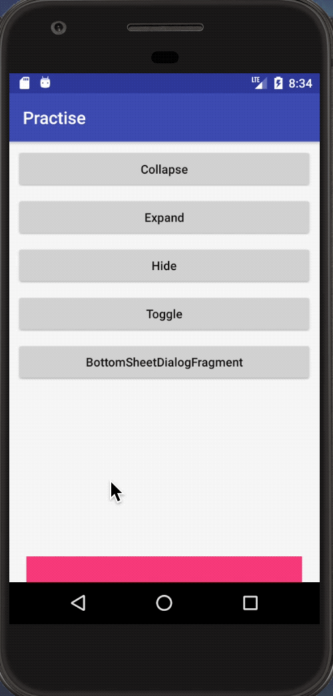

# Bottom Sheet

<div align="center">
    
</div>

### BottomSheetBehavior

#### 使用

1. 随便一个 ViewGroup 即可，但必须是 CoordinatorLayout 的直接子类：

   ``` xml
   <android.support.design.widget.CoordinatorLayout 
       xmlns:android="http://schemas.android.com/apk/res/android"
       xmlns:app="http://schemas.android.com/apk/res-auto"
       android:layout_width="match_parent"
       android:layout_height="match_parent">
       
       <!--主布局-->
       <android.support.constraint.ConstraintLayout ...>
   
       <!--BottomSheet-->
       <include layout="@layout/view_bottom_sheet" />
   </android.support.design.widget.CoordinatorLayout>
   ```

2. BottomSheet 的根布局（比如 id 为 view_bottom_sheet）需要添加如下属性：

1. ``` xml
   <LinearLayout xmlns:android="http://schemas.android.com/apk/res/android"
       xmlns:app="http://schemas.android.com/apk/res-auto"
       android:id="@+id/view_bottom_sheet"
       ...
       app:behavior_hideable="true"	 // 是否可隐藏，非必须
       app:behavior_peekHeight="50dp"	// 折叠时的高度，默认为 0，非必须
       app:layout_behavior="@string/bottom_sheet_behavior"	// 必须>
   </LinearLayout>
   ```

3. 在代码中获取：

   ``` java
   mBottomSheetBehavior = BottomSheetBehavior.from(findViewById(R.id.view_bottom_sheet));
   ```

4. 可通过 `setState(final @State int state)` 方法设置它的状态，状态类型如下：

   * BottomSheetBehavior.STATE_EXPANDED：展开
   * BottomSheetBehavior.STATE_COLLAPSED：折叠
   * BottomSheetBehavior.STATE_HIDDEN：隐藏，如果没有设置 `app:behavior_hideable="true"` 或者值为 false，设置该状态将崩溃：`java.lang.IllegalArgumentException: Illegal state argument: 5`

5. 还可通过 ` setBottomSheetCallback(BottomSheetCallback callback)` 方法监听状态变化

### BottomSheetDialogFragment

#### 使用

1. 创建一个 Fragment 继承 BottomSheetDialogFragment

2. 使用 Fragment 的 `show(FragmentManager manager, String tag)` 方法展示

   ``` java
   public class CustomBottomSheetDialogFragment extends BottomSheetDialogFragment {
   	...
   }
   
   // 显示
   CustomBottomSheetDialogFragment.newInstance().show(getSupportFragmentManager(), "dialog");
   ```

### 示例

[BottomSheetActivity](app/src/main/java/com/itscoder/ljuns/practise/bottomsheet/BottomSheetActivity.java)